 

#
## 👨‍💻 Sobre mim

Me chamo **Denzel**, sou estudante de **Engenharia de Software** no Centro Universitário do Planalto Central Apparecido dos Santos (**UNICEPLAC**) e atualmente estou no segundo período do curso.

Tenho interesse em **programação, desenvolvimento de software e tecnologia**, buscando constantemente aprimorar meus conhecimentos através de estudos e projetos práticos.

Atualmente, tenho domínio dos fundamentos da linguagem **C** e estou aprofundando meus conhecimentos em **Java**, além de trabalhar com **HTML, CSS e JavaScript** no desenvolvimento web.

 

#

<h3 align="left">🌐 Entre em contato</h3>

 

#

<h3 align="left">💻 Tecnologias</h3>

#### 🧠 Linguagens

  

#### 🔧 Ferramentas

 
 

#

## 📚 Estudando

 

 

## 📊 GitHub Statistics

 

##  My Contribution Graph

<picture>
  <source media="(prefers-color-scheme: dark)" srcset="https://raw.githubusercontent.com/Poluxzz/Poluxzz/output/github-contribution-grid-snake-dark.svg">
  <source media="(prefers-color-scheme: light)" srcset="https://raw.githubusercontent.com/Poluxzz/Poluxzz/output/github-contribution-grid-snake.svg">
  
</picture>

#

  

### 「Throughout Heaven and Earth, I alone am the honored one.」

